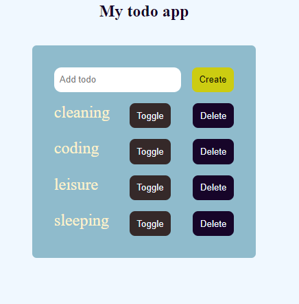
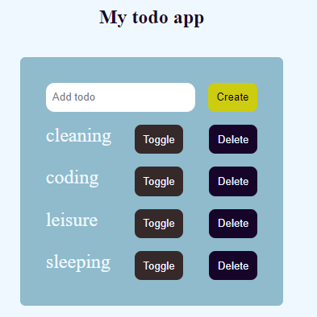
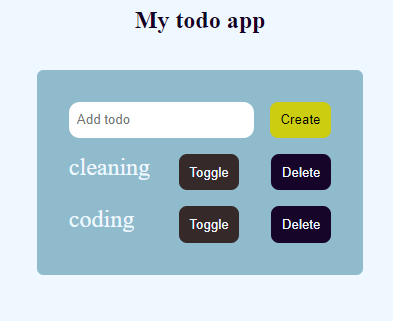

# react projects
# 1. a books filter app
# 2. a background color switch app
#  todo app

the full application looks like this with a user able to add,delete and toggle changes

after a toggle the todo list item will change the color

on delete the item is removed from the screen 

